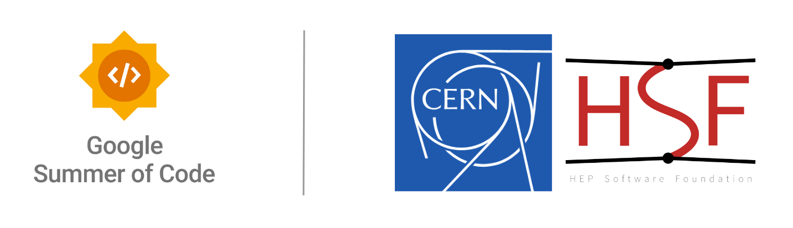

# E-QUEST: A Sustainability Benchmark for Classical & Quantum Algorithms

[](https://summerofcode.withgoogle.com/)
[](https://hep-software-foundation.org/)
[](https://www.python.org/)
[](https://opensource.org/licenses/MIT)

<p align="center">
  
</p>


### 📌 Project Info  
| **Organization** | CERN-HSF |
|:-----------------|:-------------------------|
| **Mentor(s)**   | MiriamLucioMartinez, Arantza Oyanguren |
| **Contributor** | Karan Singh |
| **Project Proposal** | Benchmarking for Sustainable Classical & Quantum Algorithms |

## Synopsis

The E-QUEST framework is a scientific benchmarking tool developed as a part of the Google Summer of Code 2025 with CERN-HSF. It is designed to address the critical challenge of rising energy consumption in High-Energy Physics (HEP) data analysis. As particle physics experiments move towards the exascale data era, the sustainability of traditional computing becomes a major concern.

This framework provides a standardized, extensible, and portable environment to systematically compare the performance and resource consumption of classical and quantum machine learning algorithms on a canonical HEP problem: particle track segment classification.

### Key Features:

*   **End-to-End Workflow:** From raw TrackML data to final analysis plots, all managed by a single conductor script.
*   **Classical vs. Quantum:** Implements a PyTorch-based Multi-Layer Perceptron (MLP) and a PennyLane-based Variational Quantum Classifier (VQC) for direct comparison.
*   **Multi-Dimensional Analysis:** Measures and compares a rich set of metrics, including computation time, peak memory usage, energy consumption (both empirical and projected), and quantum-specific metrics like gate count and circuit depth.
*   **Hardware-Aware & Portable:** The framework correctly adapts to the user's hardware, using high-precision timers for both GPU and CPU execution and providing a robust Conda environment for cross-platform reproducibility.
*   **Automated Reporting:** Automatically generates a suite of scientific plots and a detailed summary report in Markdown.


### Key Achievements    

This project successfully delivered on the core objectives outlined in the GSoC proposal:

-   **[✔] Goal: Design a modular, extensible framework.**
    -   **Achievement:** Implemented an object-oriented framework using an Abstract Base Class (`src/base_algorithm.py`), which allows new algorithms to be added in a plug-and-play manner. The architecture is detailed in `docs/FRAMEWORK_ARCHITECTURE.md`.

-   **[✔] Goal: Implement and analyze classical and quantum algorithms.**
    -   **Achievement:** Successfully integrated a classical MLP (PyTorch) and a hybrid VQC (PennyLane) for the task of track segment classification.

-   **[✔] Goal: Focus on sustainability and performance metrics.**
    -   **Achievement:** Developed a multi-dimensional analysis pipeline that measures Time, Peak Memory, and Energy. It provides both hardware-dependent empirical results and hardware-independent theoretical projections based on MAC operations (classical) and gate counts (quantum).

-   **[✔] Goal: Provide benchmark results and analysis.**
    -   **Achievement:** The framework automates the generation of a suite of scientific plots and a final, detailed Markdown report that compares the algorithms across all key metrics.

---

## Installation

A comprehensive, step-by-step guide is available in **[`docs/INSTALLATION.md`](./docs/INSTALLATION.md)**.

For a quick setup, ensure you have Conda and Git installed, then run the following commands:

1.  **Clone the Repository:**
    ```bash
    git clone https://github.com/KaranSinghDev/E-QUEST_Final.git
    cd E-QUEST_Final
    ```
2.  **Create & Activate the Conda Environment:**
    Choose the environment file that matches your hardware (`environment-gpu.yml` for NVIDIA users, `environment-cpu.yml` for others).
    ```bash
    # Example for GPU users:
    conda env create -f environment-gpu.yml
    conda activate equest-env
    ```
    > **For full quantum GPU acceleration**, please follow the detailed manual setup guide in **[`docs/INSTALLATION.md`](./docs/INSTALLATION.md)**.
Note: If having any problem with the compatability issues in linux, it is recommended to skip "torchaudio","torchvision".
---

### Setting Up the Data

The E-QUEST framework requires the TrackML particle tracking dataset to run. The repository includes a small sample of 5 events to allow for immediate testing, but for a full benchmark, you will need to download the data yourself.

**1. Download the Dataset:**
*   Navigate to the official [**TrackML Kaggle Competition page**](https://www.kaggle.com/competitions/trackml-particle-identification/data).
*   You will need a Kaggle account to download the data.
*   Download one or more of the `train_*.zip` files (e.g., `train_1.zip`). Each file contains several thousand unique particle collision events.

**2. Place the Data Files:**
*   Unzip the downloaded file.
*   The framework expects all the individual event files (e.g., `event000001000-hits.csv`, `event000001000-truth.csv`, etc.) to be placed inside a single directory.
*   For example, you could create a new folder named `my_trackml_data` and place all the event files inside it.

**3. Configure the Framework:**
*   Before running the benchmark, you must tell the framework where to find your data.
*   Open the configuration file you plan to use (e.g., `src/config_full.py`).
*   Find and update the `RAW_EVENTS_DIR` variable to point to your new data folder:
    ```python
    # Example configuration:
    RAW_EVENTS_DIR = "data/Data_Sample"
    ```

**Note on Data Files:** For each event (e.g., `event000001000`), the official `trackml` library helper function requires all four associated files (`-hits.csv`, `-truth.csv`, `-cells.csv`, and `-particles.csv`) to be present for successful data loading. While our framework's core logic primarily uses the `hits` and `truth` data, all four files must be in the directory.

---

## Quick Start: Running the Framework

The entire workflow is managed by the `run_benchmark.py` conductor script.

*   **To run a quick "smoke test" (2-5 minutes):**
    This will run the full pipeline on a small dataset to verify the installation is working correctly.
    ```bash
    python run_benchmark.py --smoke-test
    ```

*   **To run the full scientific benchmark (may take several hours):**
    ```bash
    python run_benchmark.py
    ```

Upon completion, all generated plots and a summary report will be available in the `results/` directory.

---

## Customizing Your Benchmark

The framework is designed to be easily configurable for your specific hardware and research questions.

### Customizing the Data

You can easily configure the framework to use any subset of the TrackML dataset.

1.  **Download and organize your data** from the [TrackML Kaggle Competition page](https://www.kaggle.com/c/trackml-particle-identification/data).
2.  **Open the configuration file** you wish to use (`src/config_full.py` for a long run, or `src/config_smoke_test.py` for a quick test).
3.  **Update the `RAW_EVENTS_DIR` variable** to point to your new data directory.
    ```python
    # Example:
    RAW_EVENTS_DIR = "path/to/my_custom_data"
    ```

### **<ins>Customizing the Benchmark Parameters</ins>**

You have full control over the benchmark itself. Open either `src/config_full.py` or `src/config_smoke_test.py` to modify:

*   **`COMPUTATION_POWER_WATTS`:** **(Most Important)** Update this with the measured power draw of your CPU or GPU under load to ensure accurate energy calculations.
*   **`CLASSICAL_INPUT_SIZES` & `QUANTUM_INPUT_SIZES`:** Change the list of data sizes to explore different scaling regimes.
*   **`MLP_EPOCHS`, `MLP_LEARNING_RATE`, etc.:** Modify any of the algorithm hyperparameters to test their impact on performance and sustainability.

---

## Project Documentation

This project is documented in a modular way to serve different user needs.

*   **[`docs/INSTALLATION.md`](./docs/INSTALLATION.md):** Detailed, platform-specific installation instructions.
*   **[`docs/FRAMEWORK_ARCHITECTURE.md`](./docs/FRAMEWORK_ARCHITECTURE.md):** A developer's guide to the code structure and design principles.
*   **[`docs/METHODOLOGY.md`](./docs/METHODOLOGY.md):** The scientific core, explaining the benchmark task, algorithms, and metrics.
*   **[`docs/ADDING_NEW_ALGORITHMS.md`](./docs/ADDING_NEW_ALGORITHMS.md):** A tutorial for developers who wish to extend the framework with their own algorithms.

## Future Work and Roadmap

The E-QUEST framework provides a robust foundation for sustainable algorithm research. The following are promising directions for future development:

*   **Integration of More Algorithms:** The framework is designed to be easily extensible. Adding more advanced models, such as Graph Neural Networks (GNNs) for classical analysis or Quantum Graph Neural Networks (QGNNs) and QAOA-based approaches for quantum analysis, would provide even richer comparisons.

*   **Hardware-Informed Projections:** A key area for future development is the integration of more sophisticated classical tracking algorithms. The original proposal considered **ACTS (A Common Tracking Software)** as a powerful candidate. Integrating its highly optimized Kalman Filter implementation would provide a crucial, industry-standard baseline against which all other algorithms could be compared.

*   **Real Quantum Hardware:** The framework's `BaseAlgorithm` interface could be extended to include a module that sends jobs to real quantum hardware via cloud services, allowing for a direct comparison of projected vs. actual energy consumption.

## License

This project is licensed under the MIT License. See the `LICENSE` file for details.

## Acknowledgments

This work was performed as part of the Google Summer of Code 2025 program with the HEP Software Foundation (CERN-HSF). I would like to express my sincere gratitude to my mentors, Miriam Lucio and Arantza Oyanguren, for their invaluable guidance and support throughout this project.
